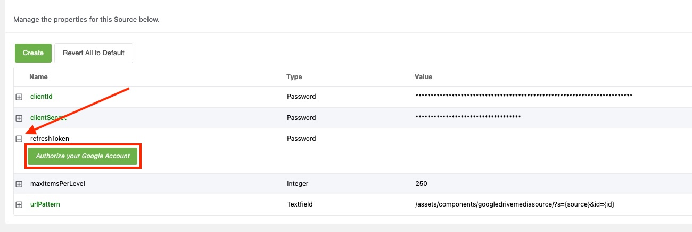

Google Drive Media Source for MODX 3.0+
---

_Built by [modmore](https://modmore.com/) for [Catch Media](https://catchmedia.no)_

This package includes a custom Flysystem Driver and MODX Media Source implementation to provide access and standard file management features for Google Drive.

## Set-up

There are a few steps to get up and running with Google Drive.

### 1. Installation

First **install the transport package**, available from MODX.com or in this repository under `/_packages/`.

Go to Media > Media Sources and create a new media source, selecting Google Drive as the source type.

### 2. Credentials

[Follow these instructions to create a Client ID and Client Secret](https://github.com/ivanvermeyen/laravel-google-drive-demo/blob/master/README/1-getting-your-dlient-id-and-secret.md). 

Set the **Authorized Redirect URIs** to the **full link to the edit media source page in your MODX Manager**, including the action and ID. For example: `https://yoursite.com/manager/?a=source/update&id=2`. You can add multiple allowed redirect URIs. 

After that, return to the media source edit page and **expand the description for the `refreshToken` property to make the authorization button visible. 



Click the button and login with your Google account. Note that the Drive integration will inherit the users' permissions, so it may be important to choose who will authorize the integration wisely.

> If you receive the error "Access blocked: Google Drive Media Source’s request is invalid" with "Error 400: redirect_uri_mismatch", you've made a mistake in setting up the redirect URI in the Google Console.

After returning from Google, the refreshToken will be filled for you.

### 3. Configuration

Now you can choose the **root** for the media source.

The root can be:

- The root of your (user) Drive by selecting the first option, `- root -`. 
- A specific folder in the root of your Drive, and its subfolders. It's not possible to select a directory that is NOT itself in the root as root for the media source.
- A Shared Drive, previously known as Team Drive. 

Simply select the desired root in the list. 

You can also set the **maxItemsPerLevel** option. This can be set to a value up to 1000 to indicate the maximum number of files or directories to appear on a specific level. The default, 250, is a reasonable trade-off between performance and usability. 

### 4. Friendlier URLs

The **urlPattern** lets you configure a friendly-ish URL to the files. All files in the Drive media source are referenced **by their ID** rather than their name. 

The default urlPattern, `/assets/components/googledrivemediasource/?s={source}&id={id}`, lets you use the media source with no changes, but results in pretty ugly URLs. 

You can configure a rewrite for Apache: 

```htaccess
RewriteCond %{REQUEST_FILENAME} !-f
RewriteCond %{REQUEST_FILENAME} !-d
RewriteRule ^drive/(.+)$ /assets/components/googledrivemediasource/index.php?s=2&id=$1 [L,QSA]
#                                             change the ID here if needed    ^^^  
```

Or for nginx (MODX Cloud):

```nginx
rewrite ^/drive/(.*)$ /assets/components/googledrivemediasource/index.php?s=2&id=$1 last;
#                                          change the ID here if needed    ^^^  
# put before the location block  
#location / {
#    try_files $uri $uri/ @modx-rewrite;
#}
```

Similarly, you could also run it off a subdomain or any other pattern, so long as requests are routed to that index file. 

The s=2 parameter indicates the **media source ID**, in this example ID 2. Change that as needed. 

The **urlPattern** in the media source can then drop the media source ID and be configured to:

```html
/gdrive/{id}
```

If you want to run it on a subdomain, simply provide the full url (including HTTPS and the domain). 
